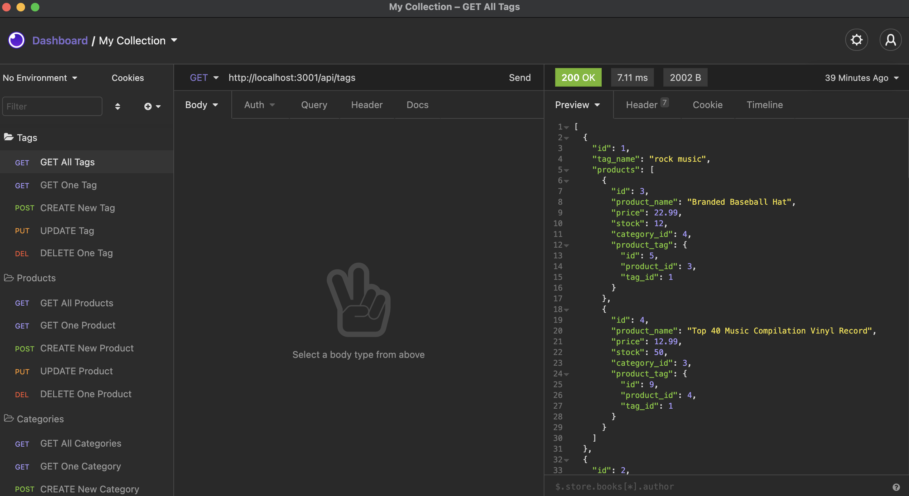
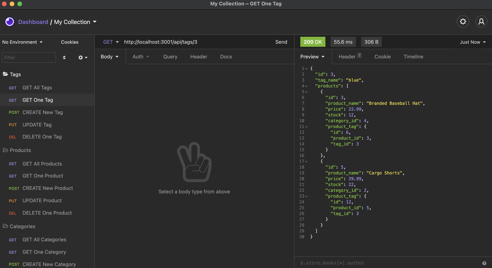
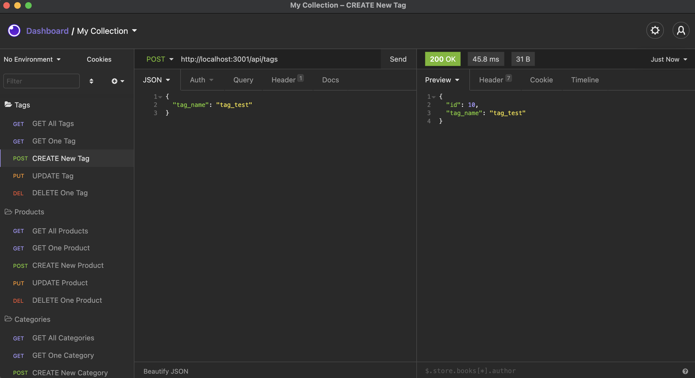

# E-Commerce Back End
Project Owner: Aaron Au Yoong
<br>
A video demo of the application can be found [here](https://youtu.be/nf3LFDj1ixw).
<br>
[](https://choosealicense.com/licenses/mit/)

## Table of Contents
* [Description](#Description)
* [License](#License)
* [Installation](#Installation)
* [Usage](#Usage)
* [Contributions](#Contributions)
* [Credits](#Credits)
* [Tests](#Tests)
* [Questions](#Questions)

## Description

This is a project focusing on the back end for an e-commerce site. For the purposes of this project, I will be configuring a working Express.js API to use Sequelize to interact with a MySQL database.

Below is the defined User Story for this application:

```md
AS A manager at an internet retail company
I WANT a back end for my e-commerce website that uses the latest technologies
SO THAT my company can compete with other e-commerce companies
```

This backend application will allow users to dynamically create, update, and delete data in their database from using an API Client such as [Insomnia Core](https://insomnia.rest/products/insomnia).

`The Database used contains the four models below.`

* `Category`

  * `id`

    * Integer.
  
    * Doesn't allow null values.
  
    * Set as primary key.
  
    * Uses auto increment.

  * `category_name`
  
    * String.
  
    * Doesn't allow null values.

* `Product`

  * `id`
  
    * Integer.
  
    * Doesn't allow null values.
  
    * Set as primary key.
  
    * Uses auto increment.

  * `product_name`
  
    * String.
  
    * Doesn't allow null values.

  * `price`
  
    * Decimal.
  
    * Doesn't allow null values.
  
    * Validates that the value is a decimal.

  * `stock`
  
    * Integer.
  
    * Doesn't allow null values.
  
    * Set a default value of `10`.
  
    * Validates that the value is numeric.

  * `category_id`
  
    * Integer.
  
    * References the `Category` model's `id`.

* `Tag`

  * `id`
  
    * Integer.
  
    * Doesn't allow null values.
  
    * Set as primary key.
  
    * Uses auto increment.

  * `tag_name`
  
    * String.

* `ProductTag`

  * `id`

    * Integer.

    * Doesn't allow null values.

    * Set as primary key.

    * Uses auto increment.

  * `product_id`

    * Integer.

    * References the `Product` model's `id`.

  * `tag_id`

    * Integer.

    * References the `Tag` model's `id`.

## License
MIT License
<br>
Copyright © 2021-Present Aaron Au Yoong. All rights reserved.
<br>
Starter code provided by © 2021 Trilogy Education Services, LLC, a 2U, Inc. brand. Confidential and Proprietary. All Rights Reserved.

## Installation
Please note that this application is meant to be the back-end of an e-commerce site, and will require connection to a front-end for public use. 

To test the back end, please follow the instructions below. 

1. Download or clone this repository `ecommerce-backend` to your local system.

2. Using your command line, navigate to the `ecommerce-backend` folder on your local system and install required NPM packages. You may do so by invoking the commands below. 

```
npm i -y
npm i dotenv
npm i express
npm i mysql2
npm i sequelize
```
3. In the application root folder, please create a .env file, and enter the following details:

```
DB_NAME = ecommerce_db, 
DB_USER = [Please insert your MySQL Workbench Username here],
DB_PW = [Please insert your MySQL Workbench Password here]
```

4. Open the file `schema.sql` in the `db` folder in MySQL workbench, and run it to create the database `ecommerce_db`.

5. Run `npm run seed` in your CLI to insert test data into `ecommerce_db`. Please note that you must have completed Step 4 and successfully created ecommerce_db for the seed files to work. 

## Usage
[Video Demo](https://youtu.be/nf3LFDj1ixw)

1. Please start the server by using the command `npm start` to successfully conduct tests on the seed data. 

2. Please ensure you have an API Client downloaded and running on your local device (e.g. [Insomnia Core](https://insomnia.rest/products/insomnia)) to continue testing this backend application. 

3. Congratulations! You may now perform GET, POST, PUT, DELETE on the database to successfully test the functionalities of this backend application. Please note that this application will be running on `http://localhost:3001`. Example request URLs are below.
```
http://localhost:3001/api/tags - to GET all tags
http://localhost:3001/api/products/1 - to GET a product by its primary key
http://localhost:3001/api/categories - to GET all categories
```

## Contributions
For contributions, you may follow the industry standard: [Contributor Covenant](https://www.contributor-covenant.org/).
<br>
Please

## Credits

* License badges used in this project were retrieved from GitHub user's `lukas-h` license-badge markdown file: [Markdown License badges](https://gist.github.com/lukas-h/2a5d00690736b4c3a7ba).

* Basic NPM Packages were used: [NPM Packages](https://www.npmjs.com/).

* Starter code provided by © 2021 Trilogy Education Services, LLC, a 2U, Inc. brand. Confidential and Proprietary. All Rights Reserved.

* Banner for README file obtained from [Vecteezy.com](https://www.vecteezy.com/vector-art/2006605-paper-art-shopping-online-on-smartphone-and-new-buy-sale-promotion-pink-backgroud-for-banner-market-ecommerce).

* Music backtrack used in the application's video demo: `Beneath The Mask (Instrumental Version) by Lyn`, from the [Persona 5 Original Soundtrack](https://music.apple.com/us/album/persona-5-original-soundtrack/1226945984). 

*NO COPYRIGHT INFRINGEMENT INTENDED* "This demonstration video uses copyrighted material in a manner that does not require approval of the copyright holder and is for educational purposes only. It is a fair use under copyright law. This video is not monetised and its sole purpose is for a university assignment, showcasing the development of an e-commerce backend application."

## Tests
Sample data from `seed.sql` was used for testing. Some screenshots of the tests are below. 

1. Testing the GET all Tags request.

<br>

2. Testing the GET one Tag request.

<br>

3. Testing the POST (create) a new Tag request.

<br>

Elaborate testing is demonstrated in the [video demo](https://youtu.be/nf3LFDj1ixw).

## Questions
Any questions? Feel free to contact me via my GitHub profile: [Aaron Au Yoong's GitHub Profile](https://github.com/aaronauyoong)
